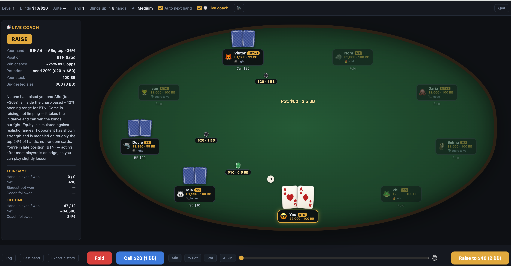

# Sit & Go Hold'em

A free, single-file No-Limit Texas Hold'em tournament game vs AI. No install, no ads, works offline — just open `poker.html` in any browser. Engine, AI, GTO solver and UI are all in the one file. Plays on desktop and mobile.

## Quick start

Double-click `poker.html`, or serve it from any static host. Set up your table (players, blinds, buy-in, ante, blind speed, AI difficulty) and play.

## Features

- **Configurable Sit & Go**: 2–9 players, starting blinds ($10/$20 up to $100/$200 — the whole blind ladder scales), buy-in in BB (50–200), ante as a fraction of the BB (none / 5% / 10% / 20%), turbo/standard/slow blind schedule (turbo raises blinds every 3 hands)
- **Money display**: $ and BB shown everywhere, casino-style chip stacks
- **Live Coach** (toggleable): position-aware preflop advice from GTO charts, range-conditioned equity postflop, order-of-action awareness (first/last to talk, including your *future* postflop position when advising preflop), bet-size-aware range reading, plain-English reasoning
- **GTO mini-solver**: real CFR (counterfactual regret minimization) for heads-up postflop spots — shows the equilibrium mixed strategy with EVs
- **Stats & training**: post-hand feedback, session + lifetime stats (persisted), full hand-history export to JSON
- **Blunder report**: every decision is scored against the coach's line in chip-EV; deviations show their estimated EV cost live, the coach panel tracks total "EV leaked" this game, and the game-over screen lists your top 5 costliest mistakes ("Hand #14 · turn — coach: FOLD, you: CALL — −$1,800")
- **Hand replayer**: browse every hand of the current game and step through it street by street — board reveals progressively, hole cards shown, action log per street. After quitting (or any time), "Review past hands" on the start screen replays your full saved history, timestamped per hand
- **Prominent raise sizing**: the coach's recommendation button reads "RAISE TO $60 · 3 BB" and the bet slider pre-sets to the suggested size — pressing R takes exactly the coach's line
- **Per-game poker stats**: VPIP, PFR, aggression factor and won-at-showdown tracked live in the coach panel
- **Resume tournament**: progress is saved at every hand boundary; refreshing or closing the tab mid-game offers a "Resume tournament" button on the start screen
- **Keyboard shortcuts**: F fold · C check/call · R raise · 1–4 bet sizes (min / ½ pot / pot / all-in) · N next hand
- **Offline mode (PWA)**: visit the hosted game once and it works with no internet afterwards; installable to home screen / dock. The local file always works offline by nature
- **Multi-language**: English, Français, Español — selector on the start screen and in the game header; choice persists. everything is translated, including the coach's full reasoning, hand names ("une Paire de Dix", "Trío de Seises"), draw names and board warnings
- **Mobile-first & touch-friendly**: responsive portrait layout, thumb-sized action buttons, slide-down coach sheet, compact table that fits all 9 seats on a phone, notch-safe insets
- **Game feel**: chips slide into the pot at the end of each street and push out to the winner, winner-seat pop, animated result banner, cards flip face-up at showdown, plus haptic feedback on mobile (your turn, your action, winning a pot)
- **More polish**: card/chip deal animations, generated sound effects with mute, auto/manual next hand, fast-forward when you fold, position badges (UTG, CO, BTN, SB, BB…). All motion respects `prefers-reduced-motion`.

## How the AI works

The AI combines three independent layers: a **difficulty level** (how well it reads its hand), a **player profile** (its temperament), and **tournament-pressure adaptation** (how its play shifts as blinds rise).

### Difficulty levels

All three run the same pipeline — estimate equity, compare to pot odds, decide — but differ in accuracy and aggression.

| | Easy | Medium | Hard |
|---|---|---|---|
| Equity estimation | 35 Monte Carlo sims | 70 sims | 160 sims (most accurate) |
| Judgment noise | ±0.22 (often misreads) | ±0.10 | ±0.045 (rarely wrong) |
| Calling | calls too wide (−0.12 vs odds) | break-even pot odds | tight, value-driven |
| Raising | rarely (~35% even with strong hands) | ~55% when ahead | ~75%, position-aware |
| Bluffing | almost never | occasional | semi-bluffs, small bluff-raises |
| Short stack | no adaptation | push/fold under 10 BB | push/fold under 10 BB |
| Position | ignored | ignored | late-position bonus |

The big lever is **judgment noise**: Easy "feels" its hand is much better or worse than it is, so it stacks off light and folds winners. Hard almost always knows where it stands. None of them can see your cards — Hard just estimates more accurately and prices its decisions tighter.

### Player profiles

On top of difficulty, every bot is dealt a random temperament (shown on its seat) that shifts how it calls, raises, bluffs and sizes bets:

- 🪨 **Tight (rock)** — folds a lot, only plays strong hands, raises rarely, bets small. Exploitable by stealing relentlessly.
- 📞 **Loose (station)** — calls far too much, but doesn't raise enough. Punish it by value-betting thin and never bluffing.
- 🦈 **Aggressive (shark)** — raises and bluffs more, applies pressure, sizes up. The toughest baseline opponent.
- 🔥 **Wild (maniac)** — huge bets, constant bluffs, very loose. High-variance; trap it with strong hands.

### Tournament-pressure adaptation (blind pressure)

Real players don't play the same with 100 BB at level 1 as with 15 BB at level 8 — and crucially, **different profiles adapt differently**. The game models this with a *pressure* factor derived from effective stack depth in big blinds (deep = 0, short ≤ 12 BB = 1), scaled by each profile's **adapt coefficient**:

| Profile | Adapt | Behavior as blinds rise |
|---|---|---|
| 🦈 Aggressive | 1.00 | Adapts most — tightens up early with deep stacks, then widens stealing ranges and fights hard for pots when short. The hallmark of a strong player. |
| 🔥 Wild | 0.70 | Already loose; gets even spewier under pressure. |
| 📞 Loose | 0.35 | Keeps calling, but starts open-shoving when short because it can't fold. |
| 🪨 Tight | 0.20 | Barely changes — still folds too much even when the blinds are eating its stack. Its exploitable flaw. |

As pressure rises, an adapting bot lowers the equity it needs to continue, widens its raising/3-bet threshold, raises more often, and — especially from late position in unopened pots — opens up its **stealing** range to fight for the blinds and antes that are now worth winning. A 🦈 shark on the button with 18 BB will open hands it would fold at 100 BB; a 🪨 rock in the same spot mostly won't budge.

## Coach & GTO solver

- **Preflop**: hands are ranked against all 169 starting hands; advice uses position-based GTO opening ranges scaled by tournament pressure (stack depth in M/BB, antes, and the profiles left to act), 3-bet/fold logic against raises, and Nash push/fold under ~10 BB. The coach shows your M-ratio and Harrington zone, warns before a blind level drops you a zone, and tells you whether you'll act first or last *after* the flop.
- **Postflop**: equity is simulated against opponents' *realistic ranges* — each call/raise narrows their assumed range, scaled by their profile **and by bet size** (a pot-sized raise or overbet is read far tighter than a small stab), not random cards.
- **Big-bet discipline**: facing large bets the coach discounts raw equity (big bets are usually made hands), warns against chasing 4-out gutshots into them, and never tells you to "take a free card" on the river — street-aware advice throughout.
- **Order of action**: every recommendation shows whether you're first or last to talk on the current street (or the upcoming flop when preflop).
- **Checks as information**: a check trims the top of an opponent's assumed range (personality-scaled — a maniac's check says more than a shark's); check-raises read as traps; checked-to-you in position triggers stab recommendations at capped ranges.
- **No-hand discipline**: with no made hand (high cards only, or just the board's pair) and no real draw, the coach heavily discounts equity when facing bets — bettors usually have at least a pair, and "pot-odds correct" high-card calls are a classic leak.
- **GTO mini-solver** (heads-up postflop): runs CFR on an abstracted tree — current street, 66%-pot + all-in sizings, 8 strength buckets, rollout-valued leaves — and prints the equilibrium mix with EVs. Directionally GTO, not solver-exact (multiway pots have no computable GTO, as with commercial solvers).

## Changelog

### 2026-06-10 — Tournament pressure & live training
- **M-ratio & Harrington zones in the coach**: every recommendation shows "M = 14 · yellow zone", with a warning when the next blind level will drop you a zone ("look for spots now rather than being forced later")
- **Stack-depth steal scaling**: late-position opening ranges widen progressively from 25 BB down to 10 BB (BTN ~42% → ~60%), early position stays disciplined — matching Harrington zone theory and solver stack-depth ranges
- **Ante-aware opens**: dead money from antes widens recommended opening ranges proportionally
- **Profile-aware stealing**: the coach reads the profiles still to act — steal wider when rocks/tights wait behind, tighter into stations and maniacs who defend or 3-bet
- **🧮 Live mental math teaching**: facing any bet, the coach shows how to compute the price (call ÷ (pot + call)), estimate win% with the ×4/×2 outs rule, and apply the same discounts it uses — so you can do it at a real table

### 2026-06-10 — Mobile & data control
- **Forced landscape on phones**: hold your phone any way you like — the game always renders in landscape (rotated automatically when held portrait); installed PWAs request landscape natively
- **Mobile layout fixes**: the start menu scrolls instead of clipping on phones, modals stay inside the viewport, replayer controls compact, extra-small tier (≤390px) shrinks seats/cards, and a seat clamp keeps every seat inside the felt so plates never spill onto the action bar
- **"Clear saved data" button** on the start menu with an ℹ️ explainer — wipes lifetime stats, hand history and any resumable tournament from the browser (language choice kept), with confirmation

### 2026-06-10 — Languages
- **French and Spanish**: language selector on the landing page and the game header — translates the full UI chrome, coach labels and recommendations, stats, blunder report, replayer and game-over screens
- **Fully translated coach reasoning**: all ~40 advice templates (preflop charts, push/fold, set-mining, pot odds, big-bet discounts, stabs, river logic), localized hand names, draw names, board-texture warnings and GTO solver notes — in all three languages

### 2026-06-10 — Reading the action & offline play
- **Checks carry information**: range floors trim opponents' top hands on checks (scaled by personality), check-raises read as traps and narrow ranges hard, stab recommendation when checked to in position — all flowing into the equity sim and the CFR solver
- **No-hand call discipline**: the coach no longer recommends "pot-odds" calls with high cards and no draw against bets — equity is discounted ~15% in those spots and the panel explains why
- **Pocket-pair implied odds**: deep stacks (40 BB+) widen pair opens (set-mining value); 15-to-1 set-mine calls vs raises
- **Offline mode (PWA)**: service worker + manifest — the hosted game keeps working without internet and can be installed as an app
- **Vercel deploy support**: root URL serves the game

### 2026-06-10 — Training & quality of life
- **Blunder report**: every decision scored against the coach in chip-EV; live "−$X EV" tags on deviations, "EV leaked" total in the coach panel, top-5 costliest mistakes on the game-over screen
- **Hand replayer**: browse every hand of the current game, step through it street by street with progressive board reveal and per-street action log
- **Per-game stats**: VPIP, PFR, aggression factor, won-at-showdown in the coach panel
- **Resume tournament**: auto-saved at every hand boundary; pick up where you left off after a refresh or restart
- **Keyboard shortcuts**: F fold · C check/call · R raise · 1–4 bet sizes · N next hand

### 2026-06-10 — Smarter coach & table setup
- Coach reads **bet size as information**: pot-sized raises and overbets narrow the opponent's assumed range sharply; raw equity is discounted against big bets, with an explicit warning against chasing gutshots into them
- Coach reads **checks as information too**: a check trims the top of an opponent's assumed range (scaled by personality — a maniac's check says more than a shark's), check-raises read as traps and narrow ranges hard, and when everyone checks to you in position the coach recommends stabbing at capped ranges
- **Order-of-action awareness**: every recommendation shows first/last to act on the current street, and preflop advice accounts for your *future* postflop position
- Street-aware advice — no more "take a free card" on the river
- Start menu: selectable **starting blinds** (whole ladder scales), **buy-in in BB**, **ante** (% of BB)
- **Turbo** now raises blinds every 3 hands

Built with Claude.
